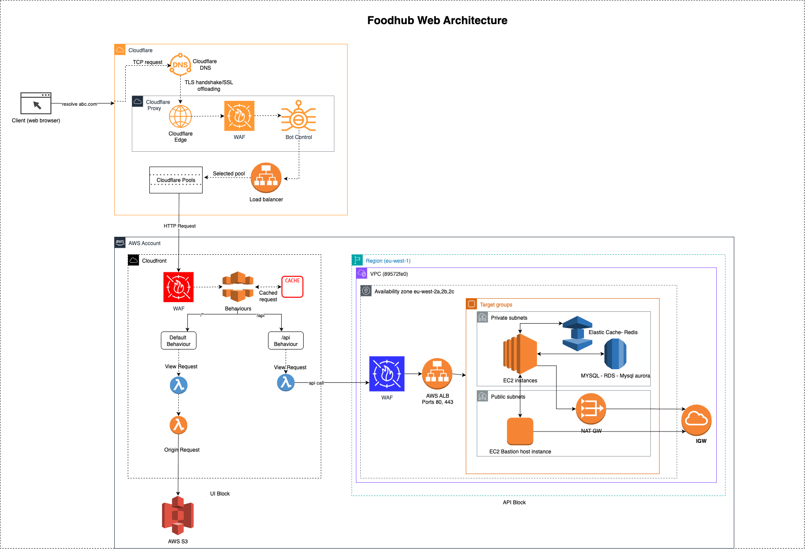

# Application Architecture: Foodhub Web

This folder contains the system architecture diagram for the Foodhub Web application.

## Architecture Diagram

- `architecture.drawio`: Editable diagram source file (use [draw.io](https://app.diagrams.net/) to edit).
- `architecture.png`: Visual overview of the Foodhub Web system architecture.

This diagram provides a high-level view of the application's components and their interactions.
