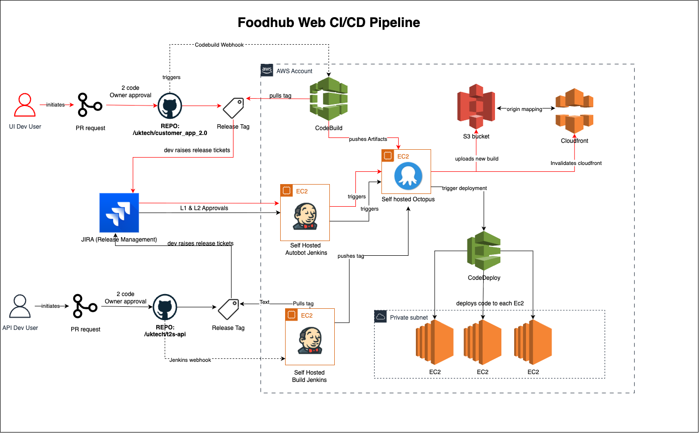

# Details

This Architecture documents the **Continuous Integration and Continuous Deployment (CI/CD)** process for the Foodhub Web platform.

---

## 1. Overview
The pipeline automates the release process for both **UI** and **API** applications.  
It integrates JIRA for release management, AWS services for build and deployment, and self-hosted tools for orchestration.

### Architecture Diagram


---

## 2. Workflow Details

### 2.1 Development & Pull Requests
- Developers (UI / API) create a **Pull Request** in:
  - `/uktech/customer_app_2.0` (UI)
  - `/uktech/t2s-api` (API)
- PRs require **two code owner approvals** before merge.

---

### 2.2 Release Tagging & Approvals
- After merging:
  - A **Release Tag** is created in the repository.
  - Developers raise **Release Tickets** in JIRA.
- **L1 & L2 approvals** in JIRA are required before moving forward.

---

### 2.3 Build Stage
#### UI Project
- AWS **CodeBuild** is triggered via webhook.
- CodeBuild:
  - Pulls the tagged source code.
  - Builds the application.
  - Pushes artifacts.

#### API Project
- **Self-Hosted Build Jenkins** pulls the tag.
- Jenkins builds and packages the API code.

---

### 2.4 Artifact Management
- **UI Build Artifacts**:
  - Uploaded to an **S3 bucket**.
  - S3 acts as the origin for **CloudFront**.
  - CloudFront is invalidated to serve the latest version.

---

### 2.5 Orchestration
- **Autobot Jenkins** manages deployment orchestration after JIRA approvals.
- Jenkins pushes tags to **Self-hosted Octopus**.
- Octopus triggers **CodeDeploy**.

---

### 2.6 Deployment
- **AWS CodeDeploy** deploys the latest build to EC2 instances:
  - Residing inside a private subnet.
  - Using rolling/in-place strategies.

---

## 3. Key Components
| Component               | Purpose |
|------------------------|----------------------------------------------------|
| JIRA                   | Release ticketing & approvals (L1 & L2) |
| GitHub Repositories    | Source code for UI and API |
| CodeBuild              | Builds UI artifacts |
| S3 Bucket              | Stores UI build artifacts |
| CloudFront             | Delivers static content globally |
| Jenkins (Autobot)      | Coordinates releases after approval |
| Jenkins (Build)        | Builds API from tags |
| Octopus Deploy         | Orchestrates deployments |
| CodeDeploy             | Deploys code to EC2 servers |
| EC2 (Private subnet)   | Hosts the deployed applications |

---

## 4. High-Level Flow

```text
- Developer → PR → Approvals → Release Tag → JIRA Tickets → Approvals  
- [UI: CodeBuild → S3 → CloudFront]  
- [API: Jenkins Build]  
- Autobot Jenkins → Octopus Deploy → CodeDeploy → EC2
```

## 5. Author
- **Author**: Mohammed Asadullah
- **Team**: Architecture Team

---

## 6. ChangeLog
| Version | Date       | Author             | Changes                    |
|---------|------------|--------------------|----------------------------|
| 1.0     | 2025-09-16 | Mohammed Asadullah | Initial document creation. |